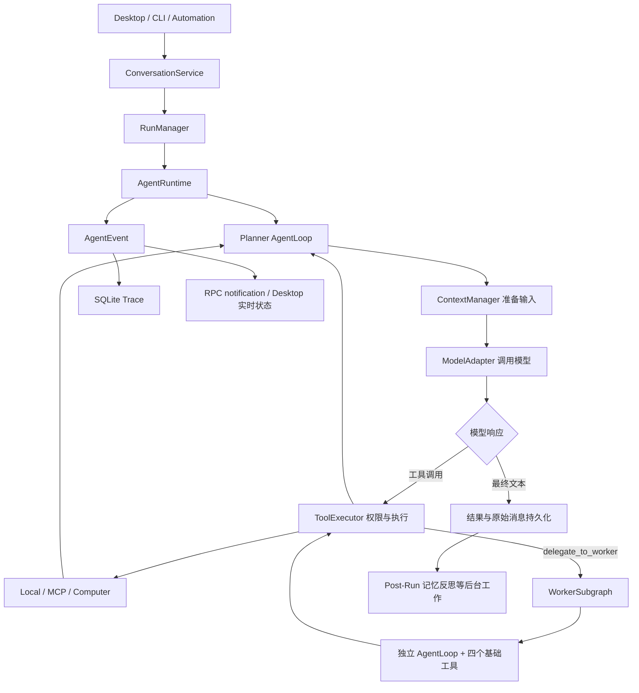
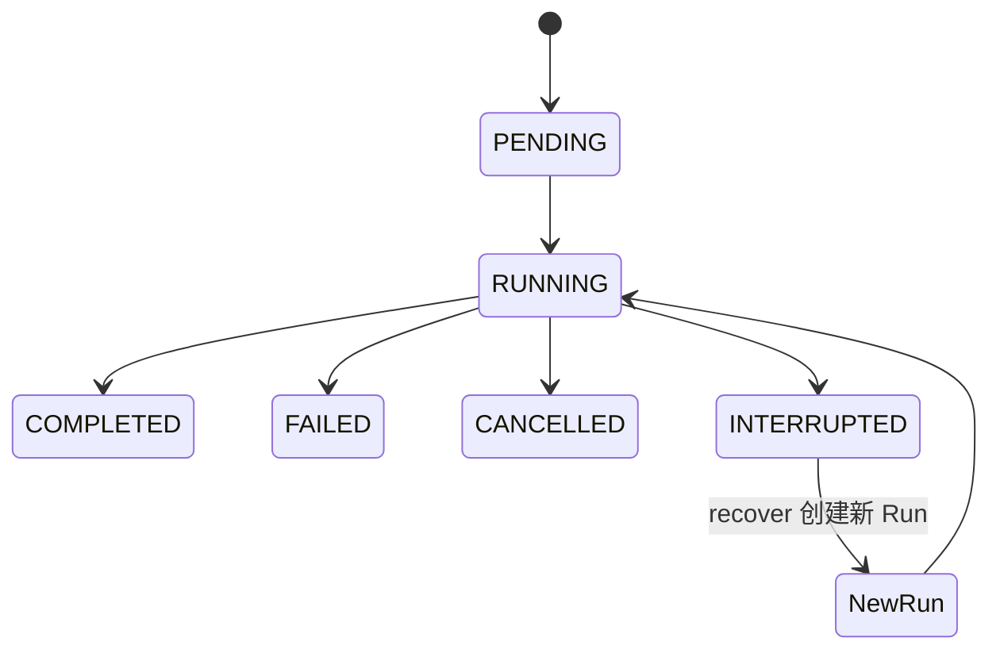

# Pluto 项目面试手册：架构、实现、技术八股与 Python 库

> 阅读基线：2026-09-09 的本地源码；基础提交为 `507332a`。本文根据实际实现整理，不把 README 的愿景当作已完成能力。示例中的 API Key 均为环境变量或占位符。库版本来自 requirements 文件，不代表“最新版本”。
>
> 建议顺序：先读第 1～4 节建立整体认知，再读第 5～12 节理解实现，随后用第 13～16 节复习库与八股，最后练习第 17～19 节的面试表达。代码路径均相对仓库根目录。

## 1. 先把项目说清楚

### 1.1 一句话介绍

Pluto 是面向 Windows 本地单用户的 AI Agent Harness：在模型外部提供工具执行、权限审批、上下文管理、持久记忆、任务跟踪、运行恢复和实时桌面交互，并支持 Planner 调用受限 Worker 完成简单子任务。

Harness 可以理解为“让模型能持续工作的运行框架”。模型负责生成文本和工具调用意图，程序负责校验、执行、保存状态和控制风险。

### 1.2 一分钟介绍模板

> 我基于一个已有 Agent 项目做了 Windows 迁移和分层 Agent 改造。后端是 Python 自研异步运行时，前端是 Electron、React 和 TypeScript，通过 WebSocket 上的 JSON-RPC 通信。Planner 负责理解目标、规划和最终汇总，把明确的简单子任务包装成结构化载荷，交给只有四个基础工具的 Worker。
>
> 我关注的是模型调用之外的工程链路：工具调用要经过权限和超时控制；同一会话的执行要串行，避免历史覆盖；长上下文要压缩但保留原始消息；执行过程中记录 Trace 和 Checkpoint，遇到中断后基于已确认的结果继续。Windows 端通过 Win32 实现窗口观察和输入，密钥支持系统凭据管理器。
>
> 这是本地开发型系统，当前不是分布式平台。Worker 的完整追踪和成本汇总、强操作系统沙箱等仍有改进空间。

请按自己实际参与的工作调整“我做了”的范围。继承的记忆、恢复、评测等模块可以说“我梳理和使用了”，不要将整个仓库都描述为独立从零开发。

### 1.3 与几种常见项目的区别

| 类型 | 核心问题 | Pluto 的位置 |
| --- | --- | --- |
| 聊天包装应用 | 调用模型、显示回答 | 包含，但不止聊天 |
| RAG 应用 | 检索资料后生成答案 | 记忆检索中使用类似思想，不是以文档问答为唯一目标 |
| 工作流引擎 | 按预定节点运行 | 有显式生命周期，但模型仍参与下一步工具选择 |
| Agent Harness | 让模型在受控环境中多轮行动 | 项目的主要定位 |
| 分布式多 Agent 平台 | 跨进程调度、队列和故障转移 | 当前没有实现 |

### 1.4 技术选型总览

| 层次 | 技术 | 为什么用 | 代价或边界 |
| --- | --- | --- | --- |
| 运行时 | Python、asyncio、自研 AgentLoop | 易对接模型和工具；适合 I/O 密集任务 | CPU 重活和同步原生调用要移出事件循环 |
| 模型 | openai、anthropic SDK + Adapter | 将多个 Provider 的差异收敛到统一接口 | 协议兼容不等于能力完全相同 |
| 本地服务 | FastAPI、Uvicorn、WebSocket、JSON-RPC | 一个连接承载请求、取消、审批和增量事件 | 重连、请求关联和背压需要自己设计 |
| 数据校验 | Pydantic v2、pydantic-settings | 统一数据模型、Schema、配置校验 | 结构合法不代表内容可信 |
| 持久化 | SQLite + aiosqlite；Markdown/JSON 文件 | 本地部署简单，文件可读，关系数据可查询 | 并发写能力有限，跨文件与数据库缺少统一事务 |
| 记忆检索 | SQLite FTS5、Embedding、余弦相似度、RRF | 同时处理精确词与语义相似 | 当前向量计算不是 ANN 索引 |
| 扩展 | 官方 MCP Python SDK、stdio | 复用外部工具协议 | 子进程资源和权限要额外管理 |
| 定时任务 | APScheduler 3.x | 原生适配 asyncio，支持计算时间触发 | 本地调度器，不是分布式任务队列 |
| 桌面 | Electron、React 18、TypeScript、Vite | 开发效率高，统一桌面 UI | 资源占用及进程安全边界需要关注 |
| 前端状态 | TanStack Query、Zustand | 分别处理服务端数据缓存与本地实时状态 | 避免两套状态重复成为事实源 |
| Windows | ctypes/Win32、pywin32、msvcrt | 窗口操作、凭据存储、文件锁 | HWND 语义不等于完整 UI Automation |
| 测试 | pytest、pytest-asyncio、Vitest、Ruff | 可注入 fake，实现离线可复现验证 | 离线通过不证明真实模型任务成功率 |

## 2. 目录与领域模型

### 2.1 源码阅读地图

```text
backend/app/
  application.py            组装依赖、启动和关闭服务
  __main__.py               CLI 模块入口
  server/                   FastAPI Host、JSON-RPC 接收与分发
  conversation/             会话、消息、统一输入执行链
  run/                      一次执行的状态和后台任务
  agent/                    主循环、Planner/Worker、预算、事件
  models/                   Provider 配置、模型协议适配
  context/                  token 估算、上下文投影、压缩与摘要
  tools/                    注册、权限、执行、搜索、Hook
  approval/                 Desktop 异步人工审批
  checkpoint/               可恢复边界
  trace/                    执行事件及用量统计
  evidence/                 完整工具输出证据
  memory/                   长期记忆、检索和反思
  task/                     长期目标和 Steps
  skills/                   Skill 解析、存储、激活
  skill_learning/           从任务证据产生候选 Skill
  automation/               定时配置、调度和投递
  mcp/                      MCP 子进程客户端与工具适配
  computer/                 Windows 窗口观察和操作
  sandbox/                  子进程启动限制
  artifact/                 文件、链接等交付物
desktop/
  electron/                 主进程与 preload 桥接
  src/rpc/                  JSON-RPC 客户端、通知和重连
  src/api/                  业务 API 封装
  src/stores/               实时状态
  src/components/           UI 组件
  src/pages/                聊天、运行、记忆、设置等页面
workspace/                  Agent 文件工具的工作目录
```

注意实际调度代码在 `app/automation/scheduler.py`，不应仅凭 README 中的目录示意说存在独立 `app/scheduler/` 包。

### 2.2 最容易混淆的对象

| 概念 | 回答什么问题 | 生命周期 |
| --- | --- | --- |
| Conversation | 用户和 Agent 聊过什么？ | 多次输入、多个 Run |
| Run | 这一次输入执行得怎样？ | 一次执行；恢复会创建新 Run |
| Task | 一个持续目标完成到哪一步？ | 可跨多次 Run |
| Context | 本次请求让模型看什么？ | 每轮重新准备的输入视图 |
| Memory | 跨会话还值得保留哪些事实？ | 长期保存并更新、归档 |
| Skill | 同类任务以后应该怎么做？ | 可复用方法，按需激活 |
| Trace | 这次执行实际发生了什么？ | 有顺序的事件记录 |
| Checkpoint | 中断时哪些操作已确认完成？ | 恢复依据 |
| Evidence | 工具真实返回了什么？ | 完整证据，可与摘要相互核对 |
| Artifact | 用户可以拿走什么结果？ | 文件或链接交付物 |

一个 Task 可以关联多个 Run；一个 Conversation 也能有多个 Run。不能把它们简单当成同一张表的不同名字。

## 3. 一条用户输入的完整执行过程

### 3.1 总体关系图



这是逻辑图，不代表代码使用了图框架。实际控制流由 Python 对象和异步函数实现。

### 3.2 分步解释

1. `server/app.py` 创建 FastAPI 应用，lifespan 中调用 `Application.start()`。后者组装模型、工具、存储、运行时和调度器；关闭时统一释放资源。
2. Desktop 通过 `WS /rpc` 发送 JSON-RPC 请求，例如 `conversation.send`。`RpcDispatcher` 将方法名映射到业务处理函数。
3. `ConversationService.dispatch()` 获取该会话的 `asyncio.Lock`，加载最新原始历史和滚动摘要，组合 Trace、桌面广播等事件观察者。
4. `RunManager.start()` 建立 Run 记录，更新状态，创建后台 `asyncio.Task` 执行 Runtime，并保留任务引用，支持 wait、cancel、interrupt。
5. `AgentRuntime` 管理公开生命周期、流式事件和恢复入口；`AgentLoop` 执行多轮模型—工具循环。
6. 循环准备系统提示、会话历史、Task/Memory/Skill 等运行上下文，选择本轮可见工具，再由 `ContextManager` 控制输入预算。
7. Adapter 调用 Provider，将文本增量、推理增量、工具调用和用量转成项目统一类型。
8. 模型若要求调用工具，`ToolRoundExecutor` 记录执行边界，逐个交给 `ToolExecutor`。工具结果按调用 ID 回填到模型消息中，继续下一轮。
9. 模型给出可交付最终答案，或步数、预算、错误、取消触发终止条件，Runtime 返回 `AgentResult`。
10. 会话服务保存原始消息和最新摘要；Trace 保留执行过程。部分记忆反思等工作交给受管理的 Post-Run 协程。

### 3.3 一个适合口述的例子

用户说：“读取 workspace 中的发布说明，整理升级清单，并生成一个计划文件。”

- Planner 负责整体理解，并将“读取文件并提取变化”作为边界明确的子任务。
- Worker 获得文件路径、提取指令和期望输出，调用 `read_file` 后返回结果。
- Planner 检查内容，继续决定清单结构，再通过自己可见的写入工具生成文件；需要审批时等待用户。
- 原始工具输出、最终文本、文件交付物属于不同数据：分别供追踪、对话展示和下载。

文件必须位于文件工具允许的 workspace 内；工具默认不能任意读取整个代码仓库。路径、权限和执行成功均须由实际工具结果确认。

## 4. Planner / Worker 分层架构

核心文件：`app/agent/hierarchy.py`、`app/agent/runtime.py`、`app/tools/registry.py`、`app/application.py`。

### 4.1 实际实现，不是框架名称

`Application` 根据 `AgentHierarchySettings` 生成 Planner 和 Worker 的模型配置与注册表。`AgentRuntime` 收到 Worker 模型注册表后：

1. 用 `ToolRegistry.restricted()` 创建只包含白名单工具的注册表。
2. 构造 `WorkerSubgraph`，内部有自己的 `AgentLoop`、`ToolExecutor` 和 `ContextManager`。
3. 把 `DelegateWorkerTool` 注册进 Planner 的工具表。
4. 给 Planner 系统提示加入判断复杂度、委派和验收要求。

Planner 调用 `delegate_to_worker` 时，程序在当前 Python 进程内 `await worker.run(...)`。没有消息队列、远程 Worker 节点或独立 Worker RunManager。

难度判断主要由提示词引导模型完成，没有单独输出 `simple/complex` 的强制路由节点。因此准确说法是“模型驱动的工具式委派”，不能宣称存在确定性的复杂度分类器。

### 4.2 标准任务合同

`WorkerTaskPayload` 使用 Pydantic，并设置 `extra="forbid"`：拒绝未声明字段。

| 字段 | 含义 | 约束 |
| --- | --- | --- |
| `objective` | 子任务目标 | 1～2000 字符 |
| `instructions` | 已拆分的执行要求 | 1～12 条 |
| `expected_output` | 验收输出形式 | 1～2000 字符 |
| `constraints` | 范围限制 | 最多 12 条 |
| `context` | 必要背景 | 可选，最多 8000 字符 |

```json
{
  "objective": "提取发布说明中的不兼容改动",
  "instructions": ["读取 release-notes.md", "逐条提取不兼容改动和影响范围"],
  "expected_output": "返回 Markdown 表格：变更、影响、原文依据",
  "constraints": ["只读", "不要制定升级计划", "缺少内容时明确说明"],
  "context": "此结果由 Planner 用于生成最终升级方案"
}
```

输出 `WorkerExecutionResult` 包含 `success`、`output`、`stop_reason`、`steps`、`usage`、`error`。注意 `success` 是执行结果标志，不是独立评审模型给出的内容正确性证明。

### 4.3 权限边界

默认 Worker 工具只有：`get_current_time`、`list_files`、`read_file`、`web_search`。

- 没有 `write_file`、Shell、Computer、MCP、Task 创建或再次委派工具。
- 构造时额外检查禁止工具是否混入注册表。
- `ContextVar` 保存当前异步上下文的 Worker 调用深度，重复嵌套时抛错；`finally` 恢复 token。
- 默认最多 4 个步骤、3 个工具轮，每次请求最大输出 token 配置为 2048；最后一个值不是整个子任务的总 token 上限。
- Worker 用空历史运行，不直接继承完整对话，也不配置长期记忆、Skill、Task 上下文或 CheckpointStore。

注册表限制是能力边界，提示词是行为约束。模型即使输出 `task_create`，注册表中没有这个工具也无法执行。但 Worker 仍通过 LLM 决定具体工具参数和是否结束，所以“没有自主规划权限”比“完全没有自主决策能力”准确。

### 4.4 为什么 `ContextVar` 比一个全局 depth 变量合适？

全局变量会让不同并发 Run 互相影响：A 正在执行 Worker，B 可能误以为自己递归。ContextVar 的值跟随异步上下文；设置后得到 token，结束时 reset。它不等于锁，也不能限制用户连续发起多个顶层 Worker。

### 4.5 当前必须知道的限制

1. **没有真正使用 LangGraph。** `Subgraph` 是本项目类名；依赖和实现中没有图编译、StateGraph 或 LangGraph checkpoint 机制。
2. **不是并行 Worker 池。** 当前工具轮使用 `for ... await` 顺序执行；多个子任务不会自动并发加速。
3. **Worker 事件不完整进入主 Trace。** 它使用 `NullEventHandler`，主链路主要看到委派工具的结果。还不能展示完整父子 Span 树。
4. **成本统计不完整。** Worker usage 位于返回载荷中，不能直接当成已合并到 Planner 的总用量和全局预算。
5. **委派受外层工具超时影响。** 默认 `ToolExecutor` 超时为 30 秒，Worker 内部模型调用即使有更长超时，也可能先被外层取消。
6. **只读不等于没有信息风险。** `web_search` 会把查询发送到外部服务；子任务上下文仍需避免含敏感信息。
7. **模型回退需读实现。** Worker Provider 未填时跟随 Planner；模型、Key、URL 的角色覆盖基于基础 `ModelSettings`，不是无条件复制所有 Planner 专属字段。

面试追问“如何继续演进”：引入父子 Run/Span、合并 usage 和父级预算、单独委派超时、可取消的受限并发池、结果验收 Schema，以及必要时的确定性路由。以上是改进方案，不是现成功能。

## 5. AgentLoop、工具协议和执行控制

### 5.1 模型并不会直接执行 Python

模型看到工具描述与 JSON Schema，返回工具名、参数字符串、调用 ID。Host 查注册表，校验并执行，再以对应 ID 返回结果。模型无法仅凭生成一个函数名就获得操作系统权限。

```text
发送 messages + tools
  → assistant.tool_calls: [{id, name, arguments}]
  → Host 执行
  → tool result: {tool_call_id, output/error}
  → 再次请求模型
```

工具调用消息与结果是协议配对关系。压缩时拆散一组，可能让 Provider 拒绝请求；不能简单保留“最后 N 条消息”。

### 5.2 各个类的分工

| 类/模块 | 职责 |
| --- | --- |
| `BaseTool` | 工具定义和统一执行接口 |
| `ToolRegistry` | 名字到工具实例的映射、重复检查、可见性、受限视图 |
| `ToolRoundExecutor` | 一个模型响应中多个工具的顺序执行与状态归并 |
| `ToolExecutor` | 权限、参数解析、超时、输出和 Hook 的共同执行边界 |
| `PermissionPolicyEngine` | 根据工具、参数、作用域匹配规则 |
| `ApprovalGate` | 人工许可的交互与等待 |
| `ToolHook` | 接入权限、事件、审计等横切逻辑 |

这是 Registry、Strategy、Adapter、Observer/Hook 等设计思想的应用，不必生硬地把每个类套成一个设计模式。

### 5.3 防失控措施

- `AgentLoop` 有步骤和工具轮限制。
- `RunBudget` 有累计用量预警、收口和硬停止阶段。
- `ToolRoundExecutor` 对连续相同调用签名计数，达到 3 次时返回重复调用错误，防止无进展重试。
- `ComputerStagnationGuard` 对桌面操作无进展进行额外保护。
- 单个工具默认超时 30 秒，模型可见工具输出默认最多 20,000 字符。
- 工具定义支持延迟加载，减少常驻 Schema；可见性还受运行模式影响。

### 5.4 权限流程

工具基础权限与动态规则是两层。基础上区分允许、需要人工、禁止；动态规则引擎返回 ALLOW / ASK / DENY。规则冲突优先 DENY，其次考虑 Run 等作用域，再比较创建时间。没有匹配规则时规则引擎返回 ASK；不要理解成每个基础只读工具都会无条件弹窗。

工具等待审批发生在执行阶段的超时块之前；批准后才进入实际工具调用。异常通常被转成结构化失败结果，让模型知道错误，而不是让整个进程崩溃。

### 5.5 完整输出与模型可见摘要

工具可能返回巨大日志。向模型只提供截断后的结果，完整内容可以交给 Evidence 存储，并返回证据 ID、SHA-256 等信息。

值得讲的细节：工具副作用已成功，但证据落盘失败时，不能把工具伪装成“执行失败”，否则模型可能重试写操作。实现区分业务执行结果和证据记录错误。

### 5.6 文件边界与 Shell 边界不是同一件事

内置文件工具使用 `Path.resolve()` 后检查 `relative_to(workspace_root)`，拒绝绝对路径和越界路径，能应对常见 `../` 与解析后的符号链接逃逸。它仍有校验和实际使用之间的 TOCTOU 风险，不应声称已对抗恶意并发文件系统变更。

Shell 是通用解释器。固定工作目录无法阻止它访问其他绝对路径。当前 Windows 后端限制见第 12 节。

## 6. 模型适配、流式返回与预算

源码：`app/models/adapter.py`、`registry.py`、`types.py`、`providers/`、`app/agent/budget.py`。

### 6.1 为什么做统一 Adapter？

业务代码使用统一 `ModelRequest`、`ModelResponse`、`Message`、`ToolCall`、`ModelUsage`。Adapter 负责将这些结构翻译成 Provider 协议。

- `OpenAICompatibleAdapter` 使用 `AsyncOpenAI`，支持 Responses 和 Chat Completions 两类接口；DeepSeek/Qwen 通过兼容接口接入。
- `AnthropicAdapter` 使用 `AsyncAnthropic`，适配 Messages 协议和其内容块结构。
- chat completion 与 embedding 使用不同接口抽象，不能把“有聊天 Key”直接等同于“支持这个向量模型”。

收益是运行循环不用跟着 Provider 改动；代价是适配层必须正确处理角色、工具消息、图像、流式分片、推理字段和 usage 差异。

### 6.2 流式如何同时支持 UI 和完整记录？

Adapter 一边读 Provider 增量，一边向回调发送文本/推理增量；结束时仍组装完整 `ModelResponse`，供执行循环、持久化和用量统计使用。工具参数也可能跨多个分片到达，不能拿第一片 JSON 就执行。

流中断时有严格重试边界：在本适配器这层，只有流已打开但尚未发出可见增量，且未超过重试次数时，才允许再尝试。用户已看到一段文本后无条件重试会产生重复显示和不一致内容。

### 6.3 三类 token 数必须分清

| 类型 | 用途 | 是否精确 |
| --- | --- | --- |
| 本地估算 token | 调用前判断上下文能否装下 | 非 OpenAI 词表尤其是近似值 |
| Provider 返回 usage | 记录真实调用用量 | 依赖 Provider 返回是否完整 |
| 项目预算 chargeable token | 提醒和停止 Run | 项目定义的控制指标，不是人民币账单 |

`RunBudget.chargeable_tokens()` 使用未缓存输入 token（未知时回退到全部输入）加输出 token。缓存输入在供应商那里可能仍收费，所以这个计数不等于准确费用；真正成本要按模型、时间和缓存价格分别计算。

源码默认 token 阈值为 80,000 预警、120,000 收口、160,000 硬限制，模型调用硬上限为 15；实际配置可覆盖。收口阶段会限制最终输出。Worker、摘要、反思等成本的统计边界要单独检查，不能只看主 Run 计数。

## 7. 上下文管理：保留历史，但不每轮全量发送

源码：`app/context/manager.py`、`budget.py`、`tokens.py`、`blocks.py`、`reducers/`、`app/agent/context_session.py`。

### 7.1 为什么不能无限追加？

历史增长会提高输入成本、增加延迟并超过上下文窗口。工具日志往往占用大量 token，却没有同等信息价值。摘要也会丢信息，所以要分层处理。

### 7.2 实际处理方式

1. 原始 Conversation 消息保留，ContextManager 生成新的请求视图，不直接修改原始历史。
2. 根据模型能力、预留输出和安全余量计算输入预算。
3. token 估算包含 messages 和工具 Schema，而不只计算用户文本。
4. 对过大的工具结果先做裁剪/整理，并按完整工具轮处理；保护协议关系。
5. 旧历史达到触发线或未摘要对话块过多时，推进滚动摘要，保存覆盖消息数等摘要状态。
6. Task、Memory、当前运行约束等动态上下文与持久对话摘要区别管理，减少把临时状态固化成历史事实的风险。
7. 上下文会话还有前缀复用/延迟压缩的控制，减少每轮重建输入导致缓存前缀抖动；仍有强制压缩与摘要陈旧度保护。

概念预算公式：

```text
可用输入预算 ≈ 模型上下文窗口 − 预留输出 token − 安全余量
实际输入占用 ≈ 消息 + 工具 Schema + 系统及运行上下文
```

### 7.3 tiktoken 在 DeepSeek 上准确吗？

不是精确计费器。项目优先使用已知 OpenAI 编码；其他模型用 `cl100k_base` 近似，再乘模型族保守系数，例如源码 DeepSeek/Qwen 默认 1.2。应以真实 usage 反馈校准，而不是把 `len(encode(text))` 宣称成所有模型的真实 token 数。

### 7.4 常见追问

**摘要错了怎么办？** 保留原始消息和 Evidence，允许回读；摘要要保留未完成目标、约束和证据引用。摘要正确性还需要测试和实际评测。

**压缩会影响 Prompt Cache 吗？** 会。前缀改动可能降低缓存复用，所以不能每轮任意重排或重写历史。但缓存命中与 Provider 策略有关，项目不能保证固定命中率。

**为什么不把所有记忆放进提示？** 长度和噪声都会增加；Core Memory 与按需召回的普通记忆承担不同职责。

## 8. 记忆系统与混合检索

源码：`app/memory/core.py`、`store.py`、`manager.py`、`recall.py`、`search_index.py`、`embedding.py`、`reflection.py`。

### 8.1 分层存储

- Core Memory：体积小、稳定、常驻，例如长期偏好和关键约束。
- Ordinary Memory：具体事实与经验，以带结构化元数据的 Markdown 管理，按需读取和归档。
- Search Index：SQLite 中的 chunk、全文索引和 embedding 等派生数据；Markdown 才是记忆内容的事实来源，索引可以重建。

这里不是用 Redis 做短期记忆，也不是用了 Milvus/FAISS。讲具体技术比只说“我做了 RAG”更有价值。

### 8.2 检索链路

```text
用户输入
  → 提取检索线索
  → FTS5 关键词检索 + embedding 语义检索
  → chunk 命中归并到 memory_id
  → RRF 融合排名
  → 有限候选及摘要/片段进入召回上下文
  → 按需读取记忆正文
```

源码向量通路会读取已存向量，在 Python 中计算余弦相似度并排序；不是近似最近邻索引。向量维度不同的记录会跳过，索引元数据还记录正文 SHA-256、revision、模型和维度，减少复用陈旧向量。

启动时可先建可用文本索引，后续后台补齐向量；向量服务失败时允许全文检索降级。没有配置有效 Embedding 服务时不能说生产运行已经使用双路语义检索。

### 8.3 必会公式与解释

```text
cosine(q, d) = (q · d) / (||q|| × ||d||)

RRF(d) = Σ 1 / (k + rank_i(d))
```

余弦相似度比较方向，弱化向量模长影响；零向量和维度不匹配必须处理。RRF 使用排名而非不同通路的原始分数，避免关键词分数和余弦值量纲不一致。

一个很好的实现细节：RRF 前先按 `memory_id` 去重。同一长记忆命中十个 chunk，不应因此比一条只含一个 chunk 的相关短记忆获得十倍排名贡献。

### 8.4 反思和维护

Run 后的反思判断是否有值得保留的事实，产生记忆动作；维护负责整理和归档。revision 可检测基于旧版本的覆盖，但要避免宣称“加了 revision 就自动支持所有跨进程原子并发更新”：正确性还依赖校验与写入是否在同一锁/事务保护内。

这属于模型生成文本后由 Host 更新存储，没有反向传播、LoRA 或模型权重训练。

### 8.5 可提出的改进

大规模数据改用 ANN/向量数据库；针对中文改进全文检索；评估 chunk 大小和重叠；引入去重、过期、用户来源与可信度；必要时增加 reranker。用 recall@k、MRR/nDCG、误召回率、检索延迟和实际任务成功率验证，不能仅凭“检索到了”证明效果。

## 9. Task、Skill 和 Skill Learning

### 9.1 Task 是可持久化进度，不是随意写一段计划

`FileTaskStore` 管理目标、Steps、状态和 revision。修改同一 Task 使用异步锁；涉及期望版本时检测冲突。步骤替换还保护已经完成或进行中的步骤，防止覆盖计划时把真实进度倒退。

文件写入使用临时文件、flush/fsync、`os.replace` 等方式降低写到一半损坏的概率。原子替换保护单个文件，不代表所有关联文件与 SQLite 记录组成一个 ACID 事务。

PLAN 是一种运行模式，有可用工具边界。注意“Planner 角色”和“PLAN 模式”不是同一个概念：前者描述角色分工，后者描述执行时允许的行为。

### 9.2 Skill 是可复用操作方法

Skill 使用 Markdown 及 YAML 元信息描述方法，先通过发现/索引选择，再按需读取并激活。这样不会把所有 Skill 正文一次塞入上下文。

Memory 偏向“知道什么”，Skill 偏向“怎么做”，Task 偏向“当前做到哪”。这三个概念在面试中必须能各举一个例子。

### 9.3 自动学习是候选生成流程

```text
Completed Tasks
  → 选择关联 Trace
  → 形成任务卡片 / 证据
  → Pattern Mining 找重复模式
  → Procedure Distillation 提炼步骤
  → SkillCandidate
  → 人工 accept / reject
  → 正式 Skill
```

`SkillLearningService` 用 batch size、watermark、inflight 等状态控制学习批次；不是每条聊天都立即产生新 Skill。候选不会直接绕过人工确认写入正式 Skill。

面试回答“Agent 会自我学习吗”：支持从完成任务的证据生成可复用 Skill 候选，属于运行时知识积累；不是自动训练出更强的基础模型。

## 10. 持久化、Run 状态与中断恢复

### 10.1 为什么 SQLite 与文件并存？

SQLite 适合 Run、消息、事件、审批等可查询结构；Task JSON、Memory/Skill Markdown 更便于人工查看和编辑。默认主要数据位于 `backend/.pluto/`，会话数据库默认是其中的 `pluto.db`。

| 数据 | 主要形式 | 设计关注点 |
| --- | --- | --- |
| Conversation、Run、Trace、Approval、Checkpoint 等 | SQLite Store | 事务、状态转换、顺序与索引 |
| Task | 文件 | 单 Task 锁、revision、原子替换 |
| Memory/Skill | Markdown 与元信息 | 可读性、版本、归档 |
| 搜索索引 | SQLite 派生索引 | 可重建、一致性校验 |
| Evidence/Artifact | 元数据与受管理内容 | 大内容分离、路径验证 |

Trace 有 `(run_id, sequence)` 唯一约束；消息有 `(conversation_id, sequence)` 唯一约束和对应查询索引。这能约束重复序号并帮助按运行/会话恢复顺序，不等于网络事件天然 exactly-once。

### 10.2 Run 生命周期



取消和中断的产品含义不同：取消是终止本次执行；中断保留可继续的边界。恢复后旧 Run 保留历史状态，新 Run 用 `recovered_from_run_id` 关联旧 Run。

### 10.3 Checkpoint 保存什么？

工具轮开始前记录待执行调用，执行成功后逐个记录已完成结果。恢复时将确认完成的结果和不确定的待执行调用作为证据注入模型，让它基于现有事实继续。

进程重启执行 reconciliation：旧 PENDING 不会自己恢复执行；旧 RUNNING 根据 Checkpoint 的实际状态调整为 INTERRUPTED、COMPLETED 或 FAILED，避免界面永远显示“运行中”。

### 10.4 最关键的追问：能否保证副作用只发生一次？

不能一般性保证。假设外部接口已成功写入，但进程在“结果存入 checkpoint 前”崩溃，恢复时只有 pending 记录，无法知道外部结果。

可做的事情：

1. 对已确认完成的调用避免直接重放。
2. 对状态不确定的写操作先查询实际状态或让用户确认。
3. 对支持的外部服务传业务幂等键，将“重试”变成“查询或复用原结果”。
4. 对需要的业务设计补偿操作，而不是假设一次数据库事务能覆盖外部系统。

当前是基于持久证据的恢复机制，不是可还原任意 Python 栈帧的进程快照，也不是 LangGraph 自动续跑。

### 10.5 aiosqlite 与数据库八股

aiosqlite 通过每连接的后台线程和请求队列执行 SQLite 操作，使等待过程不阻塞 asyncio。它没有把 SQLite 变成分布式数据库或多写者引擎。[官方说明](https://aiosqlite.omnilib.dev/en/stable/)

必须能回答：

- ACID：原子性、一致性、隔离性、持久性；一致性约束还需要业务设计。
- 参数化 SQL 防止输入被当成 SQL 语法，不能用字符串拼接用户数据。
- SQLite 同时写入受限；事务太长会增加锁等待。
- `BEGIN IMMEDIATE` 提前获取写事务所需锁；项目审批状态切换使用它保证只从 PENDING 完成一次。
- WAL 可以改善读写并发，但不是多写者并发，也不能仅凭用了 SQLite 就声称仓库已启用 WAL。
- 跨进程部署需要重新审视连接、锁、调度和数据一致性。

## 11. 异步审批、实时通信和前端

### 11.1 等待用户，为什么不会卡住整个服务？

`DesktopApprovalGate` 的顺序是：持久化 PENDING → 创建并登记 Future → 广播 `approval.required` → `await future`。用户通过 RPC 批准/拒绝后，先完成数据库状态转换，再唤醒等待协程。

必须先登记 Future 再广播。否则用户快速批准时，数据库可能已变更，但内存中还没有对应等待者，造成“已批准但不继续”的竞态。

`await future` 只让当前执行协程暂停，事件循环还能接收审批或取消消息。断开 Desktop 不会自动批准。

### 11.2 为什么 WebSocket 能同时处理长请求和取消？

`RpcConnection` 每次收消息都用 `asyncio.create_task()` 分发，再立即继续收下一条；不能在 receive 循环中等待整个 Agent 完成。发送使用单连接的 `asyncio.Lock`，避免并发写 socket。

断线后已启动的 Agent 继续运行，只停止向这条连接发送。显式 `run.cancel` 才触发 RunManager 取消。这符合后台本地 Agent 的产品行为。

### 11.3 JSON-RPC 2.0 例子

```json
{"jsonrpc":"2.0","id":17,"method":"run.cancel","params":{"run_id":"run-id"}}
```

```json
{"jsonrpc":"2.0","id":17,"result":{"status":"cancelled"}}
```

```json
{"jsonrpc":"2.0","method":"agent.event","params":{"run_id":"run-id","sequence":8}}
```

上面是协议形状示意，具体业务字段以 RPC handler 为准。请求用 id 关联响应，notification 没有 id，不要求响应。WebSocket 是传输通道，JSON-RPC 是消息格式和调用约定。

### 11.4 前端状态组织

- `RpcClient` 的 pending Map 保存请求 Promise；响应按 id resolve/reject。
- 断线会 reject 当前 pending，重连有延迟及随机扰动；不会自动重发修改类请求，避免重复副作用。
- TanStack Query 管理列表、详情等服务端缓存；Zustand 保存实时事件、状态和 Toast 等。
- React 负责组件展示；TypeScript 提供开发期静态检查，不自动校验服务器发来的运行时 JSON。
- Electron 主进程处理原生窗口与桌面能力，preload 通过桥暴露有限接口，Renderer 呈现页面。

源码设置 `contextIsolation: true`、`nodeIntegration: false`，但 `sandbox: false`。不能只看到前两项就声称 Renderer 已启用 Electron 完整沙箱。

### 11.5 背压与规模限制

当前 RPC 每请求创建 Task，Hub 逐个向连接广播。并不意味着已实现请求并发上限、每客户端有界队列或慢客户端隔离。在单用户场景可用；扩展时应限制在途请求、合并高频 token 增量、设发送超时并支持持久事件补拉。

WebSocket 断线重连本身不保证丢失事件自动补齐。Trace 可以作为回读依据，但必须实现相应客户端游标和同步逻辑才能声称“断线无损”。

## 12. Windows、MCP、搜索、调度与交付物

### 12.1 Windows Computer Runtime

`WindowsComputerRuntime` 通过标准库 `ctypes` 加载 user32/gdi32/kernel32：

- `EnumWindows` / `EnumChildWindows` 枚举 HWND 和子控件。
- GDI `BitBlt` 等采集像素，编码截图。
- `SendInput` 投递键盘和鼠标输入。
- 观察结果带 observation ID 和元素引用，只保留有限最近映射，减少陈旧引用和长期增长。
- 阻塞调用放到 `asyncio.to_thread()`，避免拖住模型流和 RPC 接收。

关键限制：HWND 树不能完整表达 Chromium/WPF 自绘控件；输入“已投递”不等于界面“已完成期望变化”；应在动作后重新观察验证。取消 `to_thread` 的等待也不会自动杀死已经运行的原生线程调用。

### 12.2 沙箱要如实解释

`WindowsRestrictedBackend` 当前实施环境变量净化、固定工作目录、进程树清理，并通过代理环境变量做尽力的网络限制。它没有实现严格文件 ACL 隔离；直接用 WinSock 的程序也可以不理代理。域名白名单无法落实时直接拒绝。

因此说“有受限进程启动策略”准确，说“所有第三方程序被强隔离，只能读写 workspace”不准确。未来可评估受限 Token、AppContainer、Windows Sandbox/容器与网络代理等，但不能宣称已完成。

### 12.3 MCP 扩展链路

`StdioMCPClient.start()` 通过 `StdioServerParameters` 定义进程，`stdio_client()` 建立输入输出通道，`ClientSession` 完成 initialize，再 list tools 和 call tool。外部工具被包装进项目工具系统，继续受执行和权限逻辑控制。

`AsyncExitStack` 管理会话和管道等多个异步上下文；启动中途失败也要清理已获取资源。第三方 Server 的普通日志不应污染协议 stdout，通常应走 stderr。

MCP 解决工具描述与调用的标准化，不是安全许可、不是大模型，也不等于多 Agent 通信系统。

### 12.4 搜索

项目使用 HTTPX 接入 Tavily，并提供 DuckDuckGo 通路；没有依赖 `tavily-python` 包。搜索服务统一结果、限制标题/摘要长度，并区分错误类型。

网络、限流、无结果等允许走降级链；认证错误直接报告，避免把错误 Key 静默隐藏。面试可说这是“基于错误类型的降级”，而不是任何失败都换一家。

### 12.5 定时调度

`AutomationScheduler` 使用 `AsyncIOScheduler`。项目实现每个 ACTIVE Automation 注册下一次的一次性 `DateTrigger`，到点后投递 `ConversationService.dispatch()`，再计算下一次时间；interval/cron 负责时间规则计算。

这样手动输入与自动输入共享历史、Trace、Run、审批流程。自动任务还有触发来源、计划时间、最近 run_id 等元数据。内存 `_running` 可以防当前进程重复启动，但不是跨进程分布式锁。

错过触发时间怎么办属于 misfire 策略；是否合并积压执行属于 coalescing 问题。应结合业务定义而不是机械“全部补跑”。[APScheduler 3.x 官方说明](https://apscheduler.readthedocs.io/en/3.x/userguide.html)

### 12.6 Artifact 与 HTTP 通道

正常业务走 RPC；健康检查、截图、Artifact 内容适合 HTTP。Artifact 下载使用受管理 ID 查路径，再做范围检查，不接受任意本地路径作为下载参数。

Loopback 限制适用于本地访问控制，不等同于完整身份认证和多租户鉴权。项目不能直接改成 `0.0.0.0` 就当公网服务上线。

## 13. Python 第三方库：项目中怎么用、面试怎么说

以下以依赖声明及源码 import 为依据。示例是用于理解 API 的最小教学片段，不替代项目现有封装；涉及网络或系统状态的片段不在生成本文时实际执行。

### 13.1 依赖清单与实际使用状态

| 包 | 仓库版本 | 用途及实际位置 |
| --- | --- | --- |
| `openai` | 2.50.0 | AsyncOpenAI，兼容聊天/Responses 和 embedding |
| `openai-agents` | 0.19.1 | requirements 声明；应用主源码未发现 `agents` 的直接导入，主循环是自研 |
| `anthropic` | 0.120.2 | AsyncAnthropic，Messages Adapter |
| `mcp` | 1.29.0 | stdio MCP 客户端；测试 fixture 使用 FastMCP |
| `fastapi` | 0.141.1 | 本地 HTTP 与 WebSocket 服务 |
| `uvicorn[standard]` | 0.52.0 | 运行 ASGI 服务；standard 为附加依赖集合，不是独立 Python 模块 |
| `pydantic-settings` | 2.14.2 | BaseSettings 加载模型、分层、搜索、预算等配置 |
| `pydantic` | 未在 requirements 中单独固定 | 广泛直接导入；由其他依赖引入，实际版本取决于环境解析 |
| `python-dotenv` | 1.2.2 | `.env` 读取支持；项目主要经 pydantic-settings 间接使用 |
| `httpx` | 0.28.1 | 网络工具、搜索、扩展导入、部分 SDK 传输 |
| `tiktoken` | 0.13.0 | 模型请求 token 估算 |
| `aiosqlite` | 0.22.1 | 异步 Store 与 FTS 索引 |
| `PyYAML` | 6.0.3 | import 名 `yaml`；Memory/Skill 元数据和评测场景 |
| `APScheduler` | 3.11.3 | import 名 `apscheduler`；Automation 调度 |
| `structlog` | 26.1.0 | 工具执行的结构化可观测性；其他模块也有标准 logging |
| `pywin32` | 312，仅 Windows | `win32cred` 接入凭据管理器；Computer 主体使用 ctypes |
| `pytest` | 9.1.1 | 后端测试 |
| `pytest-asyncio` | 1.4.0 | 异步测试支持 |
| `ruff` | 0.16.0 | 静态检查和导入顺序等；不是运行时库 |
| `psutil` | 7.1.3 | 开发依赖；验证取消后没有残留进程 |

没有使用 LangChain、LangGraph、Celery、Redis、SQLAlchemy、FAISS 或 Milvus，不要为了显得技术栈丰富把它们写成项目已经采用的技术。

### 13.2 openai：兼容模型的异步客户端

```python
import os
from openai import AsyncOpenAI

async def ask_model() -> str:
    async with AsyncOpenAI(
        api_key=os.environ["DEEPSEEK_API_KEY"],
        base_url="https://api.deepseek.com",
        timeout=30.0,
        max_retries=1,
    ) as client:
        response = await client.chat.completions.create(
            model=os.environ["DEEPSEEK_MODEL"],
            messages=[{"role": "user", "content": "用一句话解释 Agent Harness"}],
        )
        return response.choices[0].message.content or ""
```

项目将上述逻辑封装在 Adapter 中，而不是让业务到处 new client。`AsyncOpenAI` 可以连接兼容 Provider；安装这个 SDK 不意味着调用的一定是 OpenAI 的模型。

工具定义通过 `tools` 参数传入；拿到 tool_calls 后由 Host 执行。SDK 不会自动帮你执行本项目的 Python 工具。

相关复习：[openai-python 官方仓库](https://github.com/openai/openai-python)。具体模型和参数以实际 Provider 支持为准，文档不验证某个实验模型的当前可用性。

### 13.3 anthropic：另一个协议的 SDK

```python
import os
from anthropic import AsyncAnthropic

async def ask_anthropic():
    async with AsyncAnthropic(api_key=os.environ["ANTHROPIC_API_KEY"]) as client:
        return await client.messages.create(
            model=os.environ["ANTHROPIC_MODEL"],
            max_tokens=512,
            messages=[{"role": "user", "content": "解释工具调用的运行流程"}],
        )
```

项目需要将 Provider 内容块转换为统一文本、工具请求与结果，不能直接把 OpenAI 的原始响应对象当作 Anthropic 的响应处理。参考：[官方 SDK](https://github.com/anthropics/anthropic-sdk-python)。

### 13.4 openai-agents：依赖声明与架构主干要区分

这个包提供 Agent、Runner、工具、handoff 等高层编排概念。但在本项目主运行链路中，使用的是 `app.agent.AgentRuntime/AgentLoop`，不是 `agents.Runner.run()`。面试时它只应被描述为已声明但未实际用于主链路的依赖。

如果未来采用高层 SDK，需要先比较生命周期、审批、checkpoint 和模型适配是否能迁移，不能同时保留两套互相冲突的运行状态机。

### 13.5 FastAPI + Uvicorn：应用和服务器分工

```python
from fastapi import FastAPI, WebSocket

app = FastAPI()

@app.get("/health")
async def health():
    return {"status": "ok"}

@app.websocket("/rpc")
async def echo_channel(ws: WebSocket):
    await ws.accept()
    while True:
        message = await ws.receive_json()
        await ws.send_json(message)  # 教学 echo，不是项目完整 RPC 实现
```

假设保存为 `demo.py`，通过 `python -m uvicorn demo:app --host 127.0.0.1 --port 8001` 启动。实际项目入口是 `python -m app.server`。

FastAPI 处理路由、生命周期和消息，Uvicorn 运行 ASGI 服务。ASGI 支持异步和 WebSocket；WSGI 的经典请求响应接口不能直接替代这套双向连接。这里不能随意启多个 worker，因为进程内 Run、Future、锁和调度器没有跨进程共享。[FastAPI WebSocket 文档](https://fastapi.tiangolo.com/advanced/websockets/)

### 13.6 Pydantic：校验数据合同

```python
from pydantic import BaseModel, ConfigDict, Field

class Subtask(BaseModel):
    model_config = ConfigDict(extra="forbid")
    objective: str = Field(min_length=1, max_length=2000)
    instructions: list[str] = Field(min_length=1, max_length=12)

task = Subtask.model_validate({
    "objective": "提取标题",
    "instructions": ["读取文件", "返回一级标题"],
})
schema = Subtask.model_json_schema()
payload = task.model_dump(mode="json")
```

`model_validate` 做校验，`model_dump` 做序列化，`model_json_schema` 生成工具 Schema。`extra="forbid"` 拒绝额外字段，不等于全模型开启 strict 类型模式，更不等于判断自然语言目标是否安全。

`SecretStr` 主要避免 repr/日志意外显示明文，不是加密存储。需要真正使用 Key 时才调用 `get_secret_value()`，不要把值记录进日志。

### 13.7 pydantic-settings 与 python-dotenv

```python
from pathlib import Path
from pydantic import SecretStr
from pydantic_settings import BaseSettings, SettingsConfigDict

class Settings(BaseSettings):
    model_config = SettingsConfigDict(
        env_file=Path("backend/.env"),
        env_file_encoding="utf-8",
        extra="ignore",
    )
    deepseek_api_key: SecretStr | None = None
    worker_max_steps: int = 4

settings = Settings()
```

通常优先级是显式构造参数高于进程环境，进程环境高于 dotenv，最后是默认值；自定义配置源会改变规则。项目用源码位置计算 `.env` 绝对路径，减少 PyCharm 工作目录变化造成的读取失败。[Settings 官方说明](https://docs.pydantic.dev/latest/concepts/pydantic_settings/)

python-dotenv 单独使用可以是：

```python
from dotenv import dotenv_values

values = dotenv_values("backend/.env")
configured = bool(values.get("DEEPSEEK_API_KEY"))  # 不输出 Key
```

`dotenv_values()` 返回映射；`load_dotenv()` 会加载到进程环境。项目主要用 BaseSettings，不需要再到处重复手动加载。修改 `.env` 后也不能假设所有已构造客户端立即热更新，通常需要重新构造或重启。

### 13.8 HTTPX：异步 HTTP 与可测试传输

```python
import httpx

async def fetch_metadata(url: str) -> dict:
    async with httpx.AsyncClient(timeout=10.0) as client:
        response = await client.get(url)
        response.raise_for_status()
        return response.json()
```

项目用于搜索和 HTTP 工具等。异步场景用 AsyncClient；连续请求应复用客户端连接池并在应用关闭时释放。HTTP 状态错误、连接错误、读取超时和 JSON 解析失败要区分，只有适合重试的失败才重试。[HTTPX 异步文档](https://www.python-httpx.org/async/)

HTTP 工具允许访问 URL 时还要考虑 SSRF、跳转、内网地址和响应大小；不能因为用了 HTTPX 就默认这些风险被库全部解决。

### 13.9 aiosqlite：异步执行 SQL

```python
import aiosqlite

async def demo_database() -> tuple | None:
    async with aiosqlite.connect(":memory:") as db:
        await db.execute("CREATE TABLE run_demo (id TEXT PRIMARY KEY, status TEXT)")
        await db.execute(
            "INSERT INTO run_demo VALUES (?, ?)", ("r1", "running")
        )
        await db.commit()
        async with db.execute(
            "SELECT status FROM run_demo WHERE id = ?", ("r1",)
        ) as cursor:
            return await cursor.fetchone()
```

问“为什么要 await commit”：事务必须明确提交；异步 API 不是自动业务提交。跨多次 SQL 的原子操作要在一个事务里，并考虑异常 rollback。游标、连接都要关闭。

### 13.10 tiktoken：token 估算

```python
import math
import tiktoken

encoding = tiktoken.get_encoding("cl100k_base")
base_tokens = len(encoding.encode("整理项目架构", disallowed_special=()))
estimated_deepseek_tokens = math.ceil(base_tokens * 1.2)
```

项目还计入角色、工具 Schema 等开销。字符数、字节数、token 数不是同一概念；示例系数是项目策略而非 DeepSeek 官方计费公式。参考：[tiktoken 官方仓库](https://github.com/openai/tiktoken)。

### 13.11 PyYAML：结构化文本与元数据

```python
import yaml

config = yaml.safe_load("name: read_release_notes\nenabled: true\n")
text = yaml.safe_dump(config, allow_unicode=True, sort_keys=False)
```

用于评测场景、Memory/Skill 元数据。优先 `safe_load`，再经 Pydantic 校验字段。安全 loader 不等于无限输入都安全，仍需限制文件大小、结构复杂度和访问路径；不要对不可信数据启用任意对象构造。

### 13.12 APScheduler：投递一次未来任务

```python
import asyncio
from datetime import UTC, datetime, timedelta
from apscheduler.schedulers.asyncio import AsyncIOScheduler
from apscheduler.triggers.date import DateTrigger

async def scheduled_action():
    print("此处应投递到 ConversationService")

async def demo_scheduler():
    scheduler = AsyncIOScheduler(timezone="UTC")
    scheduler.add_job(
        scheduled_action,
        DateTrigger(run_date=datetime.now(UTC) + timedelta(seconds=1)),
        id="example-job",
        replace_existing=True,
    )
    scheduler.start()
    try:
        await asyncio.sleep(2)
    finally:
        scheduler.shutdown(wait=False)
```

这段对应 3.x API，不能照搬其他大版本的 Scheduler 用法。项目额外将 Automation 状态保存到自己的 Store，在启动时恢复调度；仅创建内存 scheduler 不会自动持久化业务。

### 13.13 MCP SDK：握手、发现、调用

```python
import sys
from mcp import ClientSession, StdioServerParameters
from mcp.client.stdio import stdio_client

async def inspect_server(server_script: str):
    params = StdioServerParameters(
        command=sys.executable,
        args=[server_script],
    )
    async with stdio_client(params) as streams:
        async with ClientSession(*streams) as session:
            await session.initialize()
            return await session.list_tools()
```

实际调用是 `await session.call_tool(name, arguments)`。生产接入还需要可信启动命令、净化环境、超时和异常清理；项目使用 SandboxSupervisor 和 AsyncExitStack 处理这些生命周期问题。参考：[官方 Python SDK](https://github.com/modelcontextprotocol/python-sdk)。

### 13.14 structlog：字段化记录工具事件

```python
import structlog

log = structlog.get_logger().bind(run_id="r1", tool_name="read_file")
log.info("tool_finished", duration_ms=12.4, success=True)
```

字段比拼接字符串更适合过滤和聚合。structlog 不是自动脱敏器；参数、Key、工具输出应主动控制。Trace 数据库用于可查询业务轨迹，日志用于诊断，两者不能互相替代。

### 13.15 pywin32：系统凭据，不是 Computer 的全部实现

```python
import win32cred

def credential_exists(target: str) -> bool:
    try:
        win32cred.CredRead(target, win32cred.CRED_TYPE_GENERIC)
        return True
    except win32cred.error as exc:
        if exc.winerror == 1168:  # ERROR_NOT_FOUND
            return False
        raise
```

项目封装 `CredRead/CredWrite/CredDelete` 管理模型密钥；凭据保护依赖 Windows 用户安全边界。示例只检查存在性，不输出 CredentialBlob。窗口控制主体是 ctypes，因此说“用 pywin32 完成所有桌面自动化”不准确。

### 13.16 pytest、pytest-asyncio、Ruff、psutil

```python
import pytest
from app.agent.hierarchy import WorkerTaskPayload

def test_payload_rejects_missing_instructions():
    from pydantic import ValidationError
    with pytest.raises(ValidationError):
        WorkerTaskPayload(objective="读取文件", expected_output="标题列表")

@pytest.mark.asyncio
async def test_async_code():
    import asyncio
    await asyncio.sleep(0)
```

真正项目测试通过 ScriptedAdapter 预置模型响应、StubTool 记录调用，验证顺序和权限。`tmp_path` 隔离文件，`monkeypatch` 替换配置/环境；pytest-asyncio 提供事件循环支持，项目设置 `asyncio_mode="auto"`。

Ruff 命令：`python -m ruff check .`。当前规则包括 E、F、I、UP，即部分风格错误、静态错误、导入顺序及升级建议。它不是运行时测试，也不是完整类型检查器。

psutil 用于进程验证：

```python
import psutil

def children_of(pid: int) -> list[int]:
    try:
        return [p.pid for p in psutil.Process(pid).children(recursive=True)]
    except psutil.NoSuchProcess:
        return []
```

用于测试取消 Shell 后是否仍有子进程；进程列表是时刻快照，生产监控要考虑进程退出竞态和权限不足。

## 14. Python 标准库与常见八股

### 14.1 项目常用标准库

| 库 | 具体作用 | 面试要点 |
| --- | --- | --- |
| `asyncio` | Task、Lock、Future、timeout、Queue、to_thread | 协作式调度，I/O 并发 |
| `contextvars` | Worker 深度、异步上下文隔离 | 跟随上下文，不是互斥锁 |
| `contextlib` | lifespan、AsyncExitStack | 异常路径仍释放资源 |
| `pathlib` | 路径解析和边界检查 | resolve 后再判断目录关系 |
| `json` | 协议、工具参数、结构化文件 | JSON 解析成功不代表符合业务 Schema |
| `dataclasses` | 内部结果和执行上下文 | 轻量数据结构；不自带 Pydantic 式校验 |
| `typing` | Protocol、Literal、类型标注 | 类型提示通常不在运行时强制执行 |
| `enum` | Run 状态、停止原因和模式 | 限制状态取值，转换仍需校验 |
| `uuid` | Run、子任务、对象标识 | 随机标识不等于权限或认证 |
| `hashlib` | 证据哈希、记忆内容版本 | 哈希校验不是加密 |
| `time` | perf_counter 耗时 | 单调时间适合测耗时 |
| `datetime`、`zoneinfo` | 调度和来源时间 | 区分 UTC 与显示时区，考虑 DST |
| `os`、`tempfile` | 临时文件、原子替换、环境 | replace 不等于跨文件事务 |
| `subprocess` | 原生程序/进程控制辅助 | 超时、取消、后代进程清理 |
| `ctypes` | Win32 函数和 C 数据结构 | argtypes/restype、指针宽度、资源句柄 |
| `msvcrt` | Windows 文件锁 | 与 asyncio.Lock 保护范围不同 |
| `logging` | 常规诊断日志 | 异常链、日志级别、敏感信息 |

### 14.2 async/await 是如何工作的？

`async def` 调用得到协程对象；await 负责等待其结果，`create_task()` 将协程安排到事件循环。等待可挂起 I/O 时，其他任务可运行。写了 async 不代表函数内的同步文件读取或 Win32 调用自动不阻塞。[Python 官方 asyncio 文档](https://docs.python.org/3/library/asyncio-task.html)

项目中模型请求、WebSocket、DB 等适合异步；阻塞 Win32 操作通过 to_thread 处理。CPU 密集计算应评估进程池、原生库或独立服务。

### 14.3 GIL、线程、进程和协程

- 传统带 GIL 的 CPython 中，同一时刻通常只有一个线程执行 Python 字节码；I/O 等场景可以释放 GIL。
- 协程是用户态协作调度，不等同于 CPU 并行。
- 线程适合包装阻塞 I/O；进程可利用多个核心，但有序列化、内存和管理成本。
- 新版 CPython 有可选 free-threaded 构建，不能不看解释器就断言项目运行在无 GIL 环境。

### 14.4 Lock、Semaphore、Queue、Future 区别

| 对象 | 用于解决 | 项目联系 |
| --- | --- | --- |
| Lock | 临界区互斥 | 同一会话历史读写 |
| Semaphore | 限制并发数量 | 未来 Worker 并发池可用；不能说已有池 |
| Queue | 生产者消费者解耦 | 流式事件传递 |
| Future | 等待某个未来结果 | 人工审批回传 |
| Task | 被调度的协程执行 | Run 和后台反思 |

队列如果不设容量就不提供真正背压；锁只保护共享对象访问，不提高并发处理能力。

### 14.5 取消与异常清理

`Task.cancel()` 是提出取消请求，不是强制终止整个进程。协程需要有机会响应取消；finally 里要释放锁、会话和临时状态。CancelledError 的传播不要随意吞掉。取消 subprocess 的等待，还需明确处理子进程树；取消线程等待不等于停止线程。

### 14.6 类型、数据模型与设计模式

Protocol 提供结构化接口约定，适合把真实模型/embedding/MCP 客户端替换成 fake；ABC 用抽象方法约束实现；Pydantic 负责运行时外部数据校验。三者各自解决不同层次的问题。

依赖注入不一定要一个 DI 框架：Application 通过构造函数把 registry/store/gate 等传入运行时，就是明确的组装入口。测试可注入替代实现，降低网络和全局变量依赖。

## 15. AI Agent 与后端高频问答

### Q1：为什么要多 Agent？一个 Agent 不够吗？

一个 Agent 可以完成大多数任务。这里分层主要用于隔离简单子任务的上下文和工具权限，并为不同价位模型分工留接口。代价是多一次委派和汇总、额外 token 与错误传播。没有实测前不宣称一定更快、更省。

### Q2：你实现的是 ReAct 吗？

可说运行方式接近“模型推理—工具行动—读取观察—继续”的循环，并采用结构化 tool calling。没有必要声称复现了某论文提示模板；也不能把 UI 中的 reasoning 文本等同于模型真实完整内部思维过程。

### Q3：Prompt 能保证安全吗？

不能。Prompt 说明意图，程序用工具注册表、参数校验、权限审批、路径规则和超时执行限制。来自网页、文件和 Worker 的文本可能含提示注入，不应成为绕过权限的指令。

### Q4：JSON Schema 能保证模型返回正确吗？

只能约束结构，且取决于 Provider 是否支持相应 strict 能力。Host 仍要验证字段、长度、路径、权限和业务语义；格式正确的错误操作照样危险。

### Q5：为什么用 WebSocket，不用 SSE？

项目既要服务端连续发事件，又要同连接收审批、取消和普通业务请求，所以采用双向 WS + JSON-RPC。SSE 适合单向服务端推送，也能结合 HTTP 完成这些业务；这是工程取舍，不是 SSE 做不到聊天。

### Q6：为什么 same-conversation 串行？

两个 Run 同时 load 同一历史，再各自 replace，后写者会覆盖前者。锁住完整 load→run→save 流程避免进程内丢更新；不同会话仍可并发。这把正确性换成同会话排队，且不能跨多个 Host 进程生效。

### Q7：浏览器断开了，任务会怎样？

运行任务由后端 RunManager 管理，断开不自动取消。前端 pending 请求会失败，但后端 Run 可以继续；重连后应查询状态，不能把“请求失败”直接等同于“业务没有执行”。

### Q8：API 超时能直接重试吗？

先判断是否有副作用、是否已看到响应、是否有幂等键。模型流尚未发可见增量可有限重试；已执行的工具写操作不能因记录失败无脑重试。限流、网络错误和认证错误需要不同策略。

### Q9：为什么没有 Redis/Celery？

当前单机单用户，asyncio Task、SQLite 和 APScheduler 满足部署简洁的目标。引入队列会增加运行依赖；若需要多机器执行、持久投递、worker 重启恢复和并发扩容，再考虑消息队列与独立执行进程。

### Q10：如何扩展成多用户系统？

首先补身份认证、用户/租户隔离、工具和凭据授权；将 Run 调度与进程内 Future 解耦，增加持久消息和审批事件；引入数据库级并发控制、独立 Worker、全局预算与配额，再做可观测性和隔离部署。只增加 HTTP worker 数会破坏现有假设。

### Q11：RAG 与 Fine-tuning 区别？

RAG 在推理时检索外部内容，适合时效知识和引用；微调改变模型参数，更多用于行为、格式和特定任务分布。此项目的 Memory/Skill 更新主要在模型外部，不属于微调。

### Q12：Chunk 大小如何选？

过小会丢上下文，过大引入噪声和成本；重叠能减少边界信息缺失，也会增加冗余。应结合记忆长度、检索指标、实际任务测试选择，不能给所有数据一个“最佳固定值”。

### Q13：为什么 RRF，而不是直接相加？

全文检索与向量相似度的分数尺度不同。RRF 依据各通路名次融合，降低归一化难度。局限是会丢失原始分数差距信息，可通过评测考虑加权、rerank 等策略。

### Q14：怎么避免模型反复调用同一个工具？

连续相同签名计数、最大步骤/工具轮、累计预算和 Computer 无进展检查。它们能限制损耗，但不是逻辑完备的循环证明：参数略变的重复操作还需要更高层进展判断。

### Q15：Checkpoint 与日志有什么不同？

日志用于排查，Trace 用于结构化追踪，Checkpoint 用于表达可恢复执行边界。仅有一段日志并不足以可靠恢复；需要明确哪些结果已确认、哪些操作状态未知。

### Q16：为什么需要 Evidence，直接保存工具输出不行吗？

大输出不适合一直放进模型上下文；保留完整证据和可见摘要可以兼顾成本与核验。证据 ID/哈希用于关联和一致性校验，但哈希本身不证明外部来源真实。

### Q17：这个项目是不是事件溯源？

它有事件记录和从事件聚合用量，但不能据此称作严格 Event Sourcing：业务状态仍由独立 Store 保存，并非所有状态都只通过完整事件重放构建。

### Q18：能否保证成本上限？

主运行时有预算阈值和有限步骤，但并行在途、Worker、摘要和 Post-Run 的统计范围会影响总账；token 也不是直接货币。应明确预算覆盖范围，未来统一父子任务成本并在请求前预留最坏额度。

### Q19：为什么定时任务也走 ConversationService？

防止定时入口与手动入口各自维护一套历史、摘要、审批和追踪。统一链路后行为一致，也容易定位“这个 Run 是谁触发的”。

### Q20：项目最明显的性能瓶颈有哪些？

模型网络延迟通常显著；工具顺序执行限制独立 I/O 并发；向量检索 Python 全量比较随数据量增长；数据库频繁写与慢 WS 客户端也可能拖慢。应先测分阶段延迟，再优化，不先声称数据库是唯一瓶颈。

### Q21：怎样做限流？

入口限制并发 Run 与请求速率；模型层按 Provider 管理并发和重试；工具层限制外部请求与输出；运行层限制 token/步骤。这些是不同资源维度。当前已有的预算和步数限制不等于已经有完整分布式限流器。

### Q22：配置 Key 放在哪？

本地 `.env` 支持开发配置；桌面模型设置支持 Windows Credential Manager。Git 只上传空 Key 模板。env/SecretStr/凭据管理器是不同机制，SecretStr 不会自动把 `.env` 加密。

### Q23：为什么用 Python，不全用 Node.js？

Agent、模型 SDK、数据校验和评测生态适合 Python；Electron/React 负责 UI。代价是双进程/双语言通信与部署复杂度，所以用固定协议边界把两部分解耦。

### Q24：异步函数里能直接操作文件吗？

可以写，但同步 I/O 可能阻塞事件循环。小文件可能影响有限，批量/大文件或原生阻塞调用应移到线程等执行器。async 标记不能自动解决阻塞。

### Q25：Post-Run 是否可靠投递？

它是内存后台任务管理器，持有 Task 引用并在关闭时有界 drain；饱和或关闭时 `submit()` 返回 False，进程崩溃仍可能丢待处理工作。不是持久任务队列，不能承诺每次反思必达。

## 16. 测试、评测和可量化结果

### 16.1 当前能引用的验证事实

本次准备文档前的会话中，已有后端完整测试结果：`975 passed, 5 skipped`，Ruff 通过。本文生成阶段没有重新调用真实模型，也没有重新运行完整测试；数字是此前验证记录，不是本轮重跑结果。

CI 配置会执行 Windows 下的后端 pytest、Ruff、compileall，以及桌面 Vitest、typecheck、build。配置存在不等于最近一次 GitHub Actions 已经通过，面试展示前应查看实际运行状态。

### 16.2 测试策略

| 层次 | 方法 | 能证明什么 |
| --- | --- | --- |
| 数据与策略单元测试 | Pydantic、预算、权限规则 | 边界输入和确定性逻辑 |
| 异步运行测试 | ScriptedAdapter + StubTool | 调用顺序、结果归并、错误分支 |
| Store 测试 | 临时目录/数据库 | 状态变更、持久化、冲突 |
| Server 测试 | FastAPI TestClient | RPC 和本地服务协议 |
| MCP 测试 | Fake MCP Server | 握手、发现、超时和结果转换 |
| 进程测试 | 真实测试子进程 + psutil | 取消和清理效果 |
| 前端测试 | Vitest、socketFactory 注入 | 请求关联、组件和重连逻辑 |
| Live Eval | 真实模型和固定场景 | Provider 兼容性与实际任务表现 |

分层测试文件 `tests/offline/agent/test_agent_hierarchy.py` 有角色配置独立性与 Planner 委派后汇总的测试。不能仅凭这个文件存在，就宣称已覆盖所有递归、预算、取消和恶意 Worker 场景。

### 16.3 下一步应补的有效测试

- Worker 请求未授权工具，确保 Host 拒绝且无副作用。
- Worker 超时/被取消后，主 Run 和工具状态正确结束。
- Worker usage 纳入父级统计后的重复计费和漏计检查。
- 工具已产生副作用但 checkpoint 未写成功的故障注入。
- 同一会话两个并发输入不丢消息。
- 审批立刻回应、重复批准、服务重启的竞态。
- 大输出、过长历史、摘要失败后仍遵守输入硬边界。
- 数据增长后的检索耗时、SQLite 锁等待与慢客户端背压。

### 16.4 不要编造指标

目前不要写“成本下降 70%”“支持万人并发”“成功率 99%”。如果要证明分层收益，可以用同一组任务比较：

```text
单 Agent vs Planner/Worker
固定 Provider、参数、工具集和环境
分别记录：任务成功率、验收质量、总 token、真实费用、端到端 P50/P95、失败原因
重复多次运行，披露样本量和波动
```

Planner/Worker 使用同一模型时，委派可能增加费用和延迟；更小 Worker 模型也可能导致返工。需要把 Worker 成本和 Planner 汇总成本一起算。

## 17. 面试表达：亮点、难点和追问

### 17.1 适合重点讲的三个故事

**故事 A：分层 Agent 的权限收敛。** 问题是主管与子执行者能力混在一起，子任务可能扩大范围。实现是标准 payload、独立受限注册表、空历史、禁止委派和 ContextVar 深度检查。结果是形成清晰执行边界；目前尚未补齐 Worker 全链路追踪与总预算。若被追问“是否完全无决策”，回答仍然由 LLM 执行工具选择，但不具备规划和扩大权限的授权。

**故事 B：异步长任务中的审批和取消。** 问题是如果接收循环直接等待 Agent，用户的批准/取消消息就无法及时处理。现有结构是请求独立 Task、审批 Future、socket 发送锁和持久审批状态。最值得强调的是 Future 注册必须早于广播，以及连接断开不等于取消业务。

**故事 C：Windows 迁移的真实代价。** 原生桌面能力、文件锁、凭据存储和 Shell 行为都需要替换。Windows 实现通过 ctypes/Win32 做观察与输入、msvcrt 做文件锁、win32cred 存 Key。强调原生调用不能阻塞事件循环；同时坦诚 HWND 能力与弱隔离的边界。

故事 B 若不是自己实现，应说“我理解并验证了这套已有设计”，再接自己在迁移/分层中如何避免破坏它。

### 17.2 五分钟展开结构

1. 30 秒：问题与产品定位，说明本地单用户。
2. 60 秒：Desktop→RPC→ConversationService→RunManager→AgentLoop 主链路。
3. 90 秒：Planner/Worker 的任务合同、工具隔离及一条具体执行例子。
4. 60 秒：挑一个可靠性细节，如审批竞态或 checkpoint 的不确定副作用。
5. 40 秒：测试方式和已验证事实。
6. 20 秒：指出一两个真实限制与下一步设计。

### 17.3 简历描述模板

> 基于既有 Agent 项目完成 Windows 迁移与分层运行时改造，使用 Python asyncio、FastAPI/JSON-RPC 和 Electron 构建本地交互链路；通过结构化任务载荷、受限工具注册表和防递归检查实现 Planner→Worker 委派，并结合现有审批、Trace、Checkpoint 和上下文机制支持多轮工具执行。

按真实职责删减，不要直接列一长串并未亲自实现的功能。测试数字可作为项目验证结果，不能包装成业务效果。

## 18. 面试前必须确认的实际限制

| 容易说错的表达 | 应该怎么说 |
| --- | --- |
| 用 LangGraph 实现主图/子图 | 自研 AgentLoop 的嵌套调用，设计上类似子流程 |
| Worker 完全不会自主决策 | Worker 没有规划/委派权限，但仍有 LLM 执行选择 |
| openai-agents 驱动整个系统 | 依赖中声明，但主循环为自研 |
| 已并行调度大量 Worker | 当前工具轮顺序执行，没有 Worker 池 |
| Planner 拥有无条件系统权限 | Planner 看到完整工具集，但执行仍受权限系统约束 |
| Windows 沙箱严格限制文件和网络 | 目前是受限启动策略，文件 ACL 和原始网络并非强隔离 |
| 所有 UI 元素都可语义识别 | 目前是 HWND 级控件，非完整 UIA 树 |
| pywin32 实现整个 Computer | Computer 主要是 ctypes；pywin32 用于凭据 |
| 恢复保证任意操作只执行一次 | 保存已确认边界，不确定副作用需要核对/幂等设计 |
| 记忆使用向量数据库 ANN | SQLite 存向量、Python 全量余弦排序 + FTS5 |
| 配置聊天模型就启用语义检索 | Embedding 配置独立且必须有效 |
| Skill Learning 自动训练模型 | 从任务证据生成文本 Skill 候选，需人工审核 |
| 缓存 token 不收费 | 项目预算口径与 Provider 实际计费不同 |
| 已统计全部 Worker 费用和 Trace | 当前返回 usage，但父子聚合与细粒度追踪有缺口 |
| 本地只监听 localhost 就完全安全 | 仍需关注本地调用方、Origin、权限和敏感内容 |
| async 可自动加速任何函数 | 主要改善 I/O 等待，CPU/原生阻塞需单独处理 |

环境也有一个需要注意的差异：README 与 CI 声明 Python 3.12，Ruff `target-version` 配为 `py314`。这不是多版本兼容性证明；应在目标解释器实际跑验证后再承诺支持范围。

## 19. 复习路线和源码定位

### 19.1 三天准备安排

**第一天：能讲完整链路。** 读第 1～6 节，手画请求流程，阅读 application、conversation/service、agent/runtime、agent/hierarchy。练习“为什么分层”和“一条工具调用如何执行”。

**第二天：能回答工程细节。** 读第 7～12 节和标准库八股，重点练习异步审批竞态、同会话并发、上下文配对、RRF、checkpoint 与幂等。

**第三天：能举证和应对质疑。** 阅读核心离线测试，按开发命令验证演示环境；准备一个成功场景和一个失败/取消场景，录下实际结果。对照第 18 节修正夸大描述。

### 19.2 最小源码清单

| 想复习什么 | 入口 |
| --- | --- |
| 全局组装 | `backend/app/application.py`：Application |
| 一次输入 | `backend/app/conversation/service.py`：dispatch |
| Run 状态 | `backend/app/run/manager.py`：start / cancel / recover / reconcile |
| 模型工具循环 | `backend/app/agent/loop.py`：AgentLoop.run |
| 分层实现 | `backend/app/agent/hierarchy.py`：WorkerSubgraph / DelegateWorkerTool |
| 注册表隔离 | `backend/app/tools/registry.py`：restricted |
| 工具安全执行 | `backend/app/tools/executor.py`：execute / _dispatch |
| 审批竞态 | `backend/app/approval/gate.py`：request_approval |
| 审批事务 | `backend/app/approval/store.py`：resolve |
| 上下文预算 | `backend/app/context/manager.py`：prepare |
| token 估算 | `backend/app/context/tokens.py`：TokenEstimator |
| 记忆混合检索 | `backend/app/memory/search_index.py`：search / _vector_search |
| 可学习 Skill | `backend/app/skill_learning/service.py`：SkillLearningService |
| RPC 不阻塞 | `backend/app/server/rpc/connection.py`：run / _send |
| 前端重连 | `desktop/src/rpc/client.ts`：RpcClient |
| Windows 能力 | `backend/app/computer/windows.py`：WindowsComputerRuntime |
| 实际隔离强度 | `backend/app/sandbox/backends.py`：WindowsRestrictedBackend |
| 分层测试 | `backend/tests/offline/agent/test_agent_hierarchy.py` |

### 19.3 自测题：离开文档还能否回答？

1. Conversation、Run、Task 各是什么？
2. Planner 判断任务简单的代码在哪里？哪些是提示词，哪些是硬约束？
3. Worker 返回 `success=true` 是否证明答案正确？
4. 文件工具为什么拒绝绝对路径，Shell 为什么仍有越界风险？
5. 为什么需要 `tool_call_id` 配对？
6. 用户立刻批准时，如何避免丢唤醒？
7. 同会话锁覆盖多大的临界区，有何代价？
8. 为什么 Worker 4 步不代表只用 2048 token？
9. 为什么当前 30 秒工具超时会影响 Worker？
10. 重启后旧 RUNNING Run 怎样处理？
11. 外部写成功但 checkpoint 没保存，怎么恢复？
12. RRF 为什么先按 memory_id 去重？
13. 没有 embedding 配置时检索如何降级？
14. to_thread 任务取消后原生函数是否一定停止？
15. 怎样用测试证明权限限制，而不只证明 Prompt 写了限制？

能把这些问题结合源码和自己的改造经历答清楚，比背一长串框架名称更有说服力。
